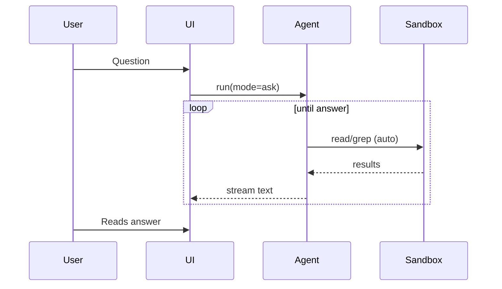

# Modes and Workflows

Spec-Version: 2.0.0

## Mode summary

There are exactly five modes. A mode is a **permission profile** first and a prompt framing second, and the authoritative definition lives in the [agent runtime spec](../04-specs/01-agent-runtime-spec.md).

| Mode ID | Entitlement | Tool classes advertised | Default decisions | Mutates workspace | Typical use |
|---|---|---|---|---|---|
| `chat` | `agent.desktop` | none | No tool calls exist; explicit attachments may be model input | No | Home conversation without implicit workspace access |
| `ask` | `modes.ask` | `read`, `network` | Read auto-allowed inside a trusted workspace; network requires policy/grant | No | Q&A about the codebase |
| `plan` | `modes.plan` | `read`, `network` | Same as Ask; the app may persist the final plan through its trusted plan-store path | Plan artifact only | Produce an implementation plan |
| `agent` | `modes.agent` | all six classes, filtered by effective policy | Read auto-allowed; network, write, execute, MCP, and outside-workspace access require the effective policy/grant | Yes | General coding tasks |
| `build` | `modes.build` | all six classes intersected with approved step scope and policy | Same as Agent, additionally denied outside the selected approved step | Yes | Execute one approved plan step |

The six canonical tool classes are `read`, `write`, `execute`, `network`, `mcp`, and `write_outside_workspace`. “Full” never means unconditional: the runtime advertises only the intersection of mode, organization policy, workspace trust, grant scope, and plan-step scope.
An approved read-only MCP tool is reclassified as `read`; Ask and Plan never
receive the general `mcp` class.

**Review is a workflow, not a mode.** It runs inside Agent mode using sub-agent roles (planner, implementer, tester, reviewer), each with its own narrower permission profile ([multi-agent](../04-specs/13-multi-agent-spec.md)).

## Mode invariants

1. Exactly five mode IDs exist. UI labels may be localized, but IDs never vary.
2. `chat`, `ask`, and `plan` MUST NOT advertise `write`, `execute`, `mcp`, or `write_outside_workspace`.
3. Network is available only where listed and is never implicitly approved.
4. Saving a plan is an application-owned plan-store operation, not a model-issued `write_file`.
5. Switching mode starts a new run boundary; no standing approval is widened by switching.
6. Review, test, implement, and planner are workflows/sub-agent roles, never additional modes.

## Ask workflow

If user requests edits: agent explains approach and suggests switching to Agent mode.

## Plan workflow

1. User describes goal in Plan mode.
2. Agent explores with `list_dir`, `read_file`, `grep`.
3. Agent outputs Markdown plan + required `plan_steps` JSON fence.
4. App saves to `<workspace>/.eury/plans/<timestamp>-<slug>.md`.
5. Plan card in chat with steps; user can edit file externally.

**No** `write_file` from model in Plan mode.

The plan-store validates the canonical plan path, creates no parent outside
`.eury/plans/`, and records the save as an application audit event.

## Agent workflow

1. User prompt → agent run.
2. Model may call tools; writes/shell require approval (unless granted).
3. Tool results fed back; loop until done or limits.
4. Run journal persisted; optional checkpoint on each write.

Limits: `max_turns` default 50, `max_wall_clock` 30 min.

## Build workflow

1. User opens plan card → "Build" on step N.
2. `plan_context` passed to agent (step id, title, completed steps).
3. Agent executes **only** step N scope.
4. App updates `## Build status` in plan markdown.
5. Repeat or stop; failed steps retry individually.

## Review workflow (Phase 20)

Runs inside Agent mode; it is an orchestration pattern, not a sixth mode.

1. User enables the Review workflow on a large task.
2. **Planner** sub-agent produces step list (may reuse plan format).
3. **Implementer** works in git worktree.
4. **Tester** runs test commands (approval for execute).
5. **Reviewer** summarizes diff; user merges worktree.

Cost cap enforced via Cersei `CostGuard` hook.

## Mode switching rules

| From | To | Behavior |
|------|-----|----------|
| Ask | Agent | New run; context preserved |
| Plan | Build | Requires saved plan with steps |
| Agent | Plan | New run recommended |
| Any | Stop | Cancel token; preserve partial |

Every transition re-evaluates entitlement, workspace trust, effective policy,
and model capability. Context may be preserved, but tool grants are not promoted
to a broader class.

## Related documents

- [../04-specs/11-plan-format-spec.md](../04-specs/11-plan-format-spec.md)
- [../04-specs/01-agent-runtime-spec.md](../04-specs/01-agent-runtime-spec.md)
