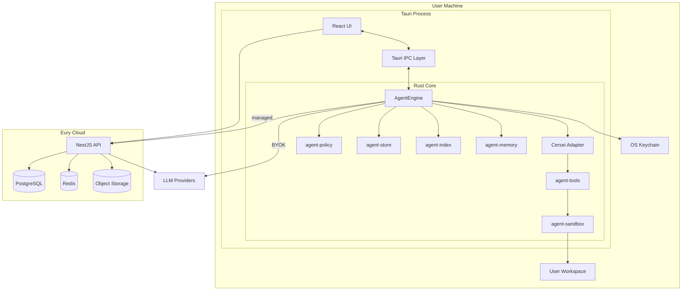

# System Architecture

Spec-Version: 1.0.0

## Overview

Eury Agent is a **local-first desktop application** with an optional **cloud control plane**. The agent loop, tool execution, indexing, and primary data store live on the user's machine. The cloud provides identity, commercial controls, managed inference, policy distribution, audit ingestion, and optional sync.



## Trust boundaries

| Boundary | Trust level | Data crossing |
|----------|-------------|---------------|
| UI ↔ Rust core | Same process, IPC validated | Events, commands, no raw FS from UI |
| Rust core ↔ workspace | Untrusted user code in workspace | Tool-mediated access only |
| Desktop ↔ cloud | Authenticated TLS | Tokens, metadata, optional sync payloads |
| Desktop ↔ LLM (BYOK) | User's API contract | Prompts, tool results, keys from keychain |
| Desktop ↔ LLM (managed) | Eury's API contract | Prompts via gateway; keys never on desktop |

## Major components

### Desktop (Tauri)

| Component | Responsibility |
|-----------|----------------|
| React UI | Shell, chat, editor, terminal, settings, approvals |
| Tauri IPC | Commands (request/response) + events (streaming) |
| `agent-core` | `AgentEngine` trait, run lifecycle, event mapping |
| Cersei adapter | `Agent::builder()`, `run_stream`, hooks, permissions |
| `agent-tools` | Tool registry, custom tools, MCP bridge |
| `agent-sandbox` | Path guard, command allowlist, OS sandbox |
| `agent-policy` | Org policy merge, approval orchestration |
| `agent-store` | SQLite persistence, migrations |
| `agent-index` | Workspace indexing, retrieval |
| `agent-memory` | Graph + EURY.md hierarchy |

### Cloud (NestJS)

One self-contained module, `AgentModule`, added to the existing Nest app. Its internal areas:

| Area | Responsibility |
|------|----------------|
| `auth/` | Agent-owned PKCE device flow, rotating refresh tokens, logout |
| `chat/` | Managed model proxy, model catalog, prompt assembly |
| `tools/` | Server-side tool proxies (web search) |
| `policy/` | Policy CRUD and distribution to desktop |
| `audit/` | Ingest signed audit batches, admin export |
| `devices/` | Enrollment, signing keys, revocation |
| `releases/` | Update manifests (`AgentRelease`) and admin publish |
| `usage/` | Quota counters and budget enforcement |
| `sync/` | Optional conversation/memory sync |
| `scim/` | SCIM 2.0 provisioning |

The module imports **infrastructure only** (`PrismaService`, config, its own `JwtService`) and no other feature module — see [backend module structure](../04-specs/16-backend-module-structure.md). Existing modules (`auth`, `billing`, `organizations`, `code`, `eury`) are left untouched.

## Data flows

### Agent run (managed model)

1. User sends prompt in UI → `agent_run_start` IPC.
2. `agent-core` assembles context (index + memory + history).
3. `agent-policy` evaluates mode and org policy.
4. Model request → `POST /agent/v1/chat/stream` → upstream LLM.
5. Cersei emits tool calls → sandbox executes → events to UI.
6. Audit batch queued locally; uploaded when online.
7. Run completes → persisted in SQLite; optional cloud sync.

### Agent run (BYOK)

Same as above except step 4 calls provider directly with key from keychain.

## Deployment topology (cloud)

```
                    ┌─────────────┐
                    │   CDN/WAF   │
                    └──────┬──────┘
                           │
              ┌────────────┴────────────┐
              │      Load balancer      │
              └────────────┬────────────┘
                           │
         ┌─────────────────┼─────────────────┐
         ▼                 ▼                 ▼
   ┌───────────┐    ┌───────────┐    ┌───────────┐
   │ Nest API  │    │ Nest API  │    │ Nest API  │
   │ instance  │    │ instance  │    │ instance  │
   └─────┬─────┘    └─────┬─────┘    └─────┬─────┘
         │                │                │
         └────────────────┼────────────────┘
                          │
              ┌───────────┴───────────┐
              ▼                       ▼
        ┌──────────┐           ┌──────────┐
        │ Postgres │           │  Redis   │
        └──────────┘           └──────────┘
```

Desktop apps are distributed via signed installers; updates check `GET /agent/v1/releases/latest`.

## Non-functional requirements

| NFR | Target |
|-----|--------|
| Availability (cloud API) | 99.9% monthly |
| RPO (cloud DB) | 1 hour |
| RTO (cloud API) | 4 hours |
| Max workspace size (indexed) | 500k files (graceful degrade beyond) |
| Offline | Read/edit local; agent requires model access (BYOK or cached grace) |

## Related documents

- [02-desktop-runtime.md](02-desktop-runtime.md)
- [03-cloud-architecture.md](03-cloud-architecture.md)
- [04-agent-engine-abstraction.md](04-agent-engine-abstraction.md)
- [05-latency-budget.md](05-latency-budget.md)
- [06-offline-and-degraded-modes.md](06-offline-and-degraded-modes.md)
- [../04-specs/16-backend-module-structure.md](../04-specs/16-backend-module-structure.md)
- [../00-overview/05-naming-and-migration-map.md](../00-overview/05-naming-and-migration-map.md)
