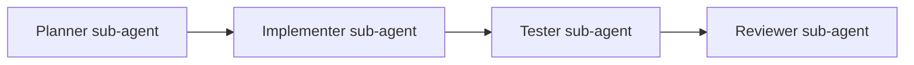

# ADR-0010: Multi-Agent Orchestration Model

Spec-Version: 1.1.0

**Status:** Accepted  
**Date:** 2026-08-16

## Context

Complex tasks benefit from specialization (plan, implement, test, review). Cersei provides sub-agents, worktrees, and task tools.

## Decision

The **Review workflow (Phase 20)** — an orchestration pattern inside Agent mode, not a separate mode — sequences four roles:

- Each sub-agent runs with a constrained tool set derived from its role.
- A sub-agent's permissions are the **intersection** of its role profile, its parent's permissions, and workspace policy, so delegation can never escalate ([multi-agent spec](../../04-specs/13-multi-agent-spec.md)).
- The implementer uses **git worktree** isolation; nothing reaches the main tree without an explicit merge approval.
- The user sees an aggregated timeline with per-role cost, and approves both the plan and the merge.
- Max 3 concurrent sub-agents, read-only roles only for fan-out; org policy may reduce further.

Single-agent operation remains the default, with no orchestration overhead.

## Consequences

**Positive:**
- Higher success rate on multi-file features.
- Clear audit trail per role.

**Negative:**
- Token cost multiplies.
- UX complexity.

**Mitigations:**
- Opt-in "Advanced" toggle.
- Cost cap hook per run.
