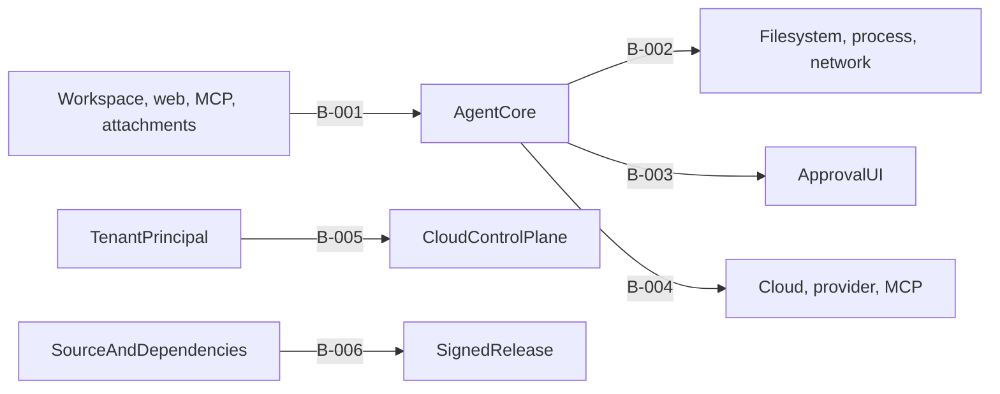

# Threat Model

Spec-Version: 2.0.0

**Owner:** Security · **Lifecycle:** approved design contract · **Review:** every
phase that adds a trust boundary, privileged capability, provider, persistence
surface, or release channel

## Scope and scoring

This model covers the desktop application, local workspace/runtime, cloud
control plane, model providers, MCP servers, and update/build channel. Inherent
and residual risk use `Low | Medium | High | Critical`. A Critical or High
residual risk requires an owner, target phase, and non-waivable verification
gate in the [risk register](../09-roadmap/risk-register.md).

## Assets

| ID | Asset | Location / flow | Sensitivity | Required controls |
|---|---|---|---|---|
| A-001 | Source code and workspace files | User disk; selected chunks may transit BYOK/provider or managed gateway | Critical | C-001, C-003, C-005, C-006, C-015, C-016 |
| A-002 | Provider, MCP, database, audit, and signing secrets | OS keychain or managed secret/HSM service only | Critical | C-006, C-009, C-010 |
| A-003 | Access/refresh/device tokens | OS keychain; non-secret metadata only in SQLite | High | C-006, C-011 |
| A-004 | Conversations, attachments, memory, and plans | Encrypted SQLite; optional policy-authorized cloud services | High | C-005, C-006, C-016 |
| A-005 | Audit events and evidence | Signed local queue and append-only cloud store | High | C-006, C-012 |
| A-006 | Organization/workspace policy and grants | Signed cloud policy, verified local cache, in-memory grants | Critical | C-003, C-007 |
| A-007 | Model prompts, responses, tool results, and summaries | Process memory and selected provider route | High | C-005, C-006, C-015, C-016 |
| A-008 | Release manifests, installers, and update trust roots | Build pipeline, release store, desktop verifier | Critical | C-009, C-010 |
| A-009 | Identity, tenancy, billing, quota, and entitlement records | Cloud database/cache | High | C-011, C-013 |

## Actors

| ID | Actor | Capability / objective |
|---|---|
| ACT-001 | Malicious repository author | Inject instructions, path tricks, build scripts, or oversized inputs |
| ACT-002 | Malicious/compromised MCP or provider | Return hostile content, tools, schemas, or cross-request data |
| ACT-003 | Network attacker | Steal/replay credentials or substitute policy/update artifacts |
| ACT-004 | Malicious insider or tenant member | Escalate role, widen policy, access another tenant, or erase evidence |
| ACT-005 | Compromised dependency/build action | Execute in CI or ship a malicious artifact |
| ACT-006 | Local malware/untrusted local user | Scrape memory/keychain/UI or tamper with local state |
| ACT-007 | Accidental operator/developer error | Misconfigure policy, retention, routing, signing, or secrets |

## Trust boundaries

| ID | Boundary | Rule |
|---|---|---|
| B-001 | Workspace/content → agent core | Content is data with explicit provenance; it never grants authority |
| B-002 | Agent core → filesystem/process/network | Every operation crosses policy, guard, and available OS containment |
| B-003 | Core → trusted approval UI → core | Approval binds exact normalized shape, risk, policy version, run, and expiry |
| B-004 | Desktop → cloud/provider/MCP | Authenticated, encrypted, policy/residency checked, minimized, and redacted |
| B-005 | Cloud tenant → shared service/database | Principal and tenant scope are enforced on every operation |
| B-006 | Source/dependency → CI → signed release | Pinned inputs, isolated build, attestations, signatures, and root recovery |

## Control registry

| ID | Control | Verification |
|---|---|---|
| C-001 | Canonical path guard, scoped roots, symlink/TOCTOU-safe open, deny globs | TEST-001 |
| C-002 | Parsed command policy plus platform OS sandbox and bounded process lifecycle | TEST-002 |
| C-003 | Canonical mode/policy decision engine; no implicit privileged allow | TEST-003 |
| C-004 | Approval anti-spoofing and exact-shape binding; forbidden actions never prompt | TEST-004 |
| C-005 | Structured provenance/trust envelope, monotonic trust, injection/grant invalidation | TEST-005 |
| C-006 | Keychain/secret-manager storage, least lifetime, redaction, no plaintext fallback | TEST-006 |
| C-007 | Signed/versioned policy, no-widen merge, downgrade/staleness handling | TEST-007 |
| C-008 | MCP manifest/tool fingerprinting, approval, transport and policy restrictions | TEST-008 |
| C-009 | Locked/pinned dependencies/actions, advisory/license gates, SBOM/provenance | TEST-009 |
| C-010 | Signed artifacts/manifests, protected root keyset, rotation and rollback | TEST-010 |
| C-011 | PKCE/token rotation, tenant-scoped authorization, IDOR and role tests | TEST-011 |
| C-012 | Device-signed sequence/hash chain, idempotent append, gap detection | TEST-012 |
| C-013 | Atomic quotas, reservations, integer money, abuse/rate controls | TEST-013 |
| C-014 | Strict CSP, sanitized rendering, constrained IPC/deep-link/clipboard handling | TEST-014 |
| C-015 | Execute egress defaults off; network approval is part of operation shape | TEST-015 |
| C-016 | Route-purpose/residency/retention checks fail closed before external transfer | TEST-016 |

## Ranked threats

| ID | STRIDE | Actor / boundary | Threat and affected assets | Inherent | Controls | Residual | Owner / gate |
|---|---|---|---|---|---|---|---|
| T-001 | T/E | ACT-001, B-001 | Repository/rule/tool content induces privileged action; A-001/A-006/A-007 | Critical | C-003, C-005 | High | Security; injection corpus at 100% |
| T-002 | E/I | ACT-001, B-002 | Traversal, symlink, race, device path, or alternate root escape; A-001/A-002 | Critical | C-001, C-003 | Medium | Security; sandbox escape suite |
| T-003 | E/I/D | ACT-001, B-002 | Build/test command executes hostile code or exfiltrates through child egress; A-001/A-002/A-007 | Critical | C-002, C-003, C-015 | High | Security; command/egress suite |
| T-004 | I | ACT-006/007, B-002/B-004 | Secret reaches disk, log, crash, support export, child env, or provider; A-002/A-003 | Critical | C-006, C-015 | Medium | Security; secret corpus/redaction test |
| T-005 | S/R | ACT-003, B-004 | Token theft, replay, or device-flow substitution; A-003 | High | C-006, C-011 | Low | Backend; auth negative suite |
| T-006 | T/E | ACT-004/007, B-003/B-004 | Policy downgrade, schema drift, unsafe merge, stale grant, or signature bypass; A-006 | Critical | C-003, C-007 | Medium | Security; policy property/contracts |
| T-007 | S/T/E | ACT-002, B-004 | MCP changes executable/schema or returns hostile cross-tool content; A-001/A-002/A-007 | Critical | C-005, C-008, C-015 | High | Security; hostile-MCP suite |
| T-008 | T/E | ACT-005, B-006 | Dependency confusion, lifecycle script, compromised action/tool; A-002/A-008 | Critical | C-009 | Medium | Platform; security CI non-waivable |
| T-009 | S/T/E | ACT-003/005, B-006 | Malicious update, key compromise, rollback, or failed trust-root rotation; A-008 | Critical | C-009, C-010 | Medium | Security/Platform; signature fixtures |
| T-010 | S/I/E | ACT-004, B-005 | Cross-tenant IDOR, role escalation, or policy/data leakage; A-004/A-005/A-006/A-009 | Critical | C-011 | Medium | Backend; tenant isolation suite |
| T-011 | R/T | ACT-004/006, B-005 | Audit deletion, replay, sequence gap, or source replication in payload; A-001/A-005 | High | C-006, C-012 | Medium | Security; audit integrity suite |
| T-012 | D | ACT-002/004, B-004/B-005 | Denial of wallet, quota race, model/tool amplification; A-009 | High | C-013 | Low | Platform; quota/cost tests |
| T-013 | S/I/T | ACT-006, local OS | Local malware scrapes UI/memory/keychain or tampers with cache; A-002–A-008 | Critical | C-004, C-006, C-007, C-010 | High | Security; accepted OS-bound residual |
| T-014 | I | ACT-007, B-004 | Managed prompt/tool/attachment/audit/telemetry routed to wrong purpose/region; A-001/A-004/A-005/A-007 | Critical | C-006, C-016 | Medium | Security; routing/residency fixtures |
| T-015 | S/E | ACT-006, B-003 | Approval spoofing, clickjacking, unsafe deep link/clipboard/webview IPC; A-006 | High | C-004, C-014 | Medium | Desktop; UI/IPC security suite |
| T-016 | T/E | ACT-001/004, B-001 | `EURY.md`, memory, summary, citation, OCR, or shared message is incorrectly upgraded to trusted | Critical | C-003, C-005 | High | Security; provenance corpus |

## Out-of-scope assumptions

- A compromised OS kernel or administrator can defeat process isolation; the
  product still minimizes secret lifetime and records capability degradation.
- Physical access to an unlocked, authenticated session is not prevented.
- Provider processing is not excluded: it is governed by route policy, DPA,
  residency, retention, and minimization controls C-006/C-016.

## Security review gate

Every PR introducing a new asset, actor, boundary, tool class, external route,
secret, persistence surface, or release input MUST update this registry and link
the applicable `A-*`, `T-*`, `C-*`, and `TEST-*` identifiers.

## Related documents

- [Sandbox model](02-sandbox-model.md)
- [Permission and policy engine](03-permission-and-policy-engine.md)
- [Prompt injection defense](05-prompt-injection-defense.md)
- [Security testing](../08-quality/04-security-testing.md)
