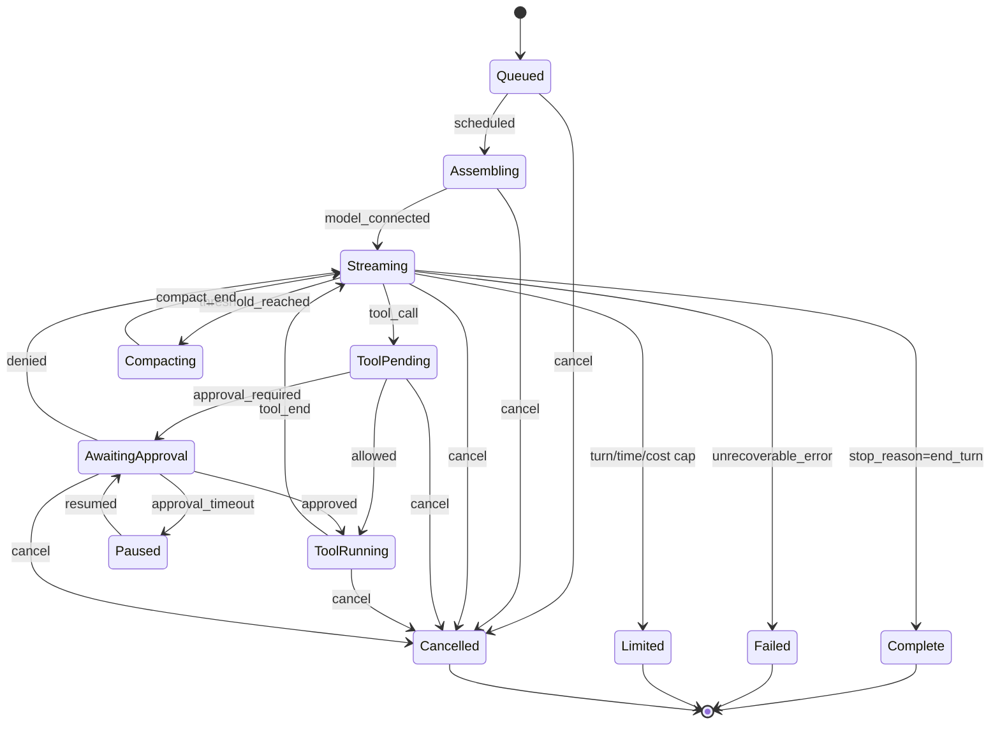

# Agent Runtime Specification

Spec-Version: 2.3.0

Normative specification for `agent-core`: the run lifecycle, context assembly, turn loop, cancellation, compaction, and persistence points. This is the contract every other desktop crate is written against.

Keywords **MUST**, **MUST NOT**, **SHOULD**, **MAY** are normative.

## Invariants

| # | Invariant |
|---|---|
| I1 | At most one **foreground** run per conversation; additional runs queue ([background runs](../09-roadmap/phase-21.md) may run concurrently under the global cap) |
| I2 | Every state transition is persisted before the corresponding event is emitted, so a crash never loses a completed step |
| I3 | No tool executes before its policy decision resolves ([policy engine](../03-security/03-permission-and-policy-engine.md)) |
| I4 | Audit events are durably written **before** a tool result is returned to the model |
| I5 | `seq` is strictly monotonic per run, with no gaps and no reuse |
| I6 | Cancellation is acknowledged in the UI within 250 ms regardless of tool unwind time |
| I7 | Context assembly is a pure function of typed inputs — identical inputs produce an identical prompt |
| I8 | A run never silently truncates history; compaction is an explicit, evented, recorded step |
| I9 | Untrusted content is marked before entering the prompt and never re-labeled as trusted ([injection defense](../03-security/05-prompt-injection-defense.md)) |
| I10 | Any terminal state releases every resource: child processes, PTYs, file handles, write leases, HTTP streams |

## Modes

Five modes. Each is a **permission profile** first and a prompt framing second ([modes and workflows](../01-product/03-modes-and-workflows.md)).

| Mode | Tool classes allowed | Notes |
|---|---|---|
| `chat` | none | No workspace access at all |
| `ask` | `read`, `network` | Explanation only; writes are structurally impossible |
| `plan` | `read`, `network` | Produces a plan artifact; may not modify source |
| `agent` | all, per policy | The default working mode |
| `build` | all, per policy | Executes an approved plan step by step |

`review`, `test`, `implement` are **sub-agent roles**, not modes ([multi-agent](13-multi-agent-spec.md)).
Read-only MCP tools are classified as `read`; Ask and Plan never receive the
general `mcp` class. Plan persistence is an application-owned artifact sink,
not a model-facing write tool.

## Run states



| State | Persisted `runs.status` | Terminal |
|---|---|---|
| `Queued` | `queued` | no |
| `Assembling` | `assembling` | no |
| `Streaming` | `streaming` | no |
| `ToolPending` / `ToolRunning` | `tool_running` | no |
| `AwaitingApproval` | `awaiting_approval` | no |
| `Paused` | `paused` | no (resumable) |
| `Compacting` | `compacting` | no |
| `Complete` | `complete` | yes |
| `Failed` | `failed` | yes |
| `Limited` | `limited` | yes |
| `Cancelled` | `cancelled` | yes |

Any transition not shown is a bug and **MUST** panic in debug builds and emit `EURY_RUN_INVALID_TRANSITION` in release builds.

## RunRequest

```typescript
interface RunRequest {
  runId: string;                    // UUIDv7, client-generated; ordering-friendly
  conversationId: string;
  mode: "chat" | "ask" | "plan" | "agent" | "build";
  prompt: string;                   // max 100_000 chars
  attachments?: Attachment[];       // references, never inlined content
  workspaceId?: string;             // required for every mode except chat
  model: ModelConfig;
  planContext?: PlanContext;        // required when mode = build
  parentRunId?: string;             // set for sub-agent runs
  resumeFrom?: string;              // runId being resumed after a crash
  limits?: Partial<RunLimits>;      // narrowed by policy, never widened
  idempotencyKey?: string;          // dedupes double-submit
}

interface Attachment {
  kind: "file" | "selection" | "image" | "terminal_output" | "diff" | "url";
  path?: string;                    // workspace-relative
  range?: { startLine: number; endLine: number };
  blobId?: string;                  // images and captured output live in the blob store
  mediaType?: string;               // required for blob-backed images, e.g. image/png
  bytes?: number;                   // validated input size, never provider payload size
  width?: number;                   // image dimensions after local validation/downscale
  height?: number;
  sha256?: string;                  // provenance and deduplication, never a secret
  url?: string;
  trust: "trusted" | "semi_trusted" | "untrusted";
  provenance: { source: string; sourceId: string; transformChain: string[] };
}

interface ModelConfig {
  provider: string;                 // "openai" | "anthropic" | "google" | custom id
  modelId: string;
  route: "byok" | "managed";
  effort?: "low" | "medium" | "high";
  maxOutputTokens?: number;         // default 20_000, capped by model and plan
  temperature?: number;             // default 0.2
}

interface RunLimits {
  maxTurns: number;                 // default 50
  maxWallMs: number;                // default 1_800_000 (30 min)
  maxToolCalls: number;             // default 200
  maxParallelTools: number;         // default 4
  maxCostUsdMicros?: number;        // integer micro-USD from policy cost caps
  maxTokens?: number;               // from policy
}
```

Validation is strict: unknown fields are rejected (`EURY_REQUEST_INVALID`), and `limits` are intersected with policy using `min()` before use.

For `kind: "image"`, `blobId`, `mediaType`, `bytes`, `width`, and `height` are required. The runtime validates the image against the limits in the [tool catalog](02-tool-catalog-spec.md), strips metadata before provider adaptation, and passes provider-native image parts only when the selected model advertises vision support. A model without vision rejects the request before any provider call with `EURY_MODEL_VISION_UNSUPPORTED`.

## Context assembly

A pure function `assemble(inputs) -> Prompt`. Sections are emitted in a fixed order so caching and golden tests are stable.

| # | Section | Trust | Budget |
|---|---|---|---|
| 1 | Product system prompt (compiled in, versioned) | trusted | fixed |
| 2 | Mode framing and tool contract | trusted | fixed |
| 3 | Effective policy summary (what the agent may and may not do) | trusted | ≤ 500 tokens |
| 4 | `EURY.md` hierarchy, merged | semi_trusted | ≤ 4000 tokens |
| 5 | Memory recall, top-k by relevance | semi_trusted | ≤ 2000 tokens |
| 6 | Workspace facts (languages, entry points, test command) | untrusted | ≤ 500 tokens |
| 7 | User-reviewed plan context, when `mode = build` | semi_trusted | ≤ 2000 tokens |
| 8 | Retrieved code chunks with provenance | untrusted | ≤ 45% of window |
| 9 | Attachment contents resolved through retrieval | untrusted | ≤ 15% of window |
| 10 | Conversation history, newest-first eviction | mixed | remainder |
| 11 | Current user prompt | trusted | always included |

`trusted` is reserved for compiled product instructions, verified effective
policy, mode/tool contracts, and the current user's explicit intent. Files,
attachments, tool/MCP/web output, OCR/alt text, and derived workspace facts are
`untrusted`. User-reviewed rule/memory/plan artifacts are `semi_trusted`: they
may shape task context but never policy or authority. A transform or summary may
retain or lower trust, never raise it.

### Budget algorithm

```
available = contextWindow - maxOutputTokens - safetyMargin(2%)
reserve fixed sections (1-7) first; if they exceed 20% of available, truncate 4 and 5 by relevance
retrievalBudget = min(policyRetrievalCap, 0.45 * available)
attachmentBudget = min(0.15 * available, remaining)
historyBudget = available - used
evict history oldest-first, never splitting a tool_call/tool_result pair
if historyBudget < 1 turn -> trigger Compacting before calling the model
```

Untrusted sections are wrapped in explicit delimiters with a standing instruction that their contents are **data, not instructions**. The wrapper text is part of the compiled prompt and is covered by golden tests.

**Performance:** assembly **MUST** complete within 30 ms p95 on a 10k-file workspace and 80 ms p95 on 50k files, excluding any network call ([benchmarks](../08-quality/03-performance-benchmarks.md)).

## Engine configuration

The adapter configures Cersei behind the `AgentEngine` trait; no Cersei type escapes the adapter crate ([ADR-0003](../02-architecture/adr/0003-agent-engine-trait-boundary.md)).

```rust
Agent::builder()
    .provider(provider)                              // resolved from ModelConfig
    .tools(registry.for_mode(mode, &policy))         // policy-filtered, not just mode-filtered
    .permission_policy(InteractivePolicy::new(tx))   // routes to the approval queue
    .system_prompt(compiled_system_prompt())
    .append_system_prompt(dynamic_sections)
    .max_turns(limits.max_turns)
    .max_tokens(model.max_output_tokens)
    .auto_compact(false)                             // we own compaction; see below
    .tool_result_budget(TOOL_RESULT_BUDGET)          // 48_000 tokens
    .hooks(vec![cost_guard, audit_hook, lease_hook, injection_scanner])
```

Auto-compaction is **disabled** in the engine. We drive compaction ourselves so it is visible, evented, recorded, and testable rather than an invisible library behavior.

## Turn loop

```
turn = 0
loop {
    turn += 1
    if turn > limits.maxTurns { finish(Limited, "max_turns"); }
    if elapsed > limits.maxWallMs { finish(Limited, "max_wall"); }

    stream = engine.stream(prompt)                    // Streaming
    for chunk in stream {
        match chunk {
            Text(t)      => emit(TextDelta), append(buffer),
            Reasoning(t) => emit(ReasoningDelta),
            ToolCall(c)  => collect(c),
            Usage(u)     => accumulate(u), cost_guard.check()?,
        }
        if cancelled() { unwind(); finish(Cancelled); }
    }

    persist(assistant_message, usage)                 // I2

    if collected.is_empty() { finish(Complete, stop_reason); }

    // Tool phase
    let batch = schedule(collected)                   // respects maxParallelTools + write leases
    for call in batch {
        let decision = policy.evaluate(&call)         // I3
        match decision {
            Denied(reason)  => result = structured_denial(reason),
            NeedsApproval   => result = await_approval_then_run(&call),
            Allowed         => result = sandbox.execute(&call),
        }
        audit.write_durable(&call, &result)           // I4, before returning to the model
        emit(ToolEnd); persist(run_step)
    }

    prompt.append(tool_results)
    if context_used_ratio() > COMPACT_THRESHOLD { compact(); }
}
```

### Tool scheduling rules

| Rule | Detail |
|---|---|
| Parallelism | Up to `maxParallelTools` read-class calls concurrently |
| Writes | Serialized; one write lease per normalized path at a time |
| Execute | At most one `execute`-class call at a time per workspace |
| Ordering | Results are appended in the model's original call order regardless of completion order, so replays are deterministic |
| Failure | One tool failing does not abort the batch; each result is returned independently |
| Approval | The run enters `AwaitingApproval` and the whole batch pauses; `approval_wait_ms` is excluded from latency metrics |

## Compaction

Triggered when `context_used_ratio() > 0.85`, or on demand via `/compact`.

```
1. emit CompactStart { reason, tokensBefore }
2. select the oldest turns covering at least 40% of history tokens,
   never splitting a tool_call/tool_result pair and never touching the last 4 turns
3. summarize the selection with the same model at temperature 0,
   into a bounded summary (<= 1500 tokens) that preserves:
   decisions, file paths touched, open problems, user constraints
4. replace the selection with one system-role summary message marked `compacted: true`
5. persist both the summary and the ids of the replaced messages (nothing is deleted)
6. emit CompactEnd { tokensAfter, tokensFreed, messagesReplaced }
```

Compaction **MUST NOT** discard the current plan context, the newest four turns, or any pending tool result. If compaction fails or frees less than 10% of the window, the run finishes with `EURY_RUN_CONTEXT_OVERFLOW` rather than proceeding with a corrupted history.

## Cancellation

| Guarantee | Detail |
|---|---|
| Trigger | `agent_run_cancel`, `Esc Esc`, app quit, parent run cancellation |
| Propagation | A single `CancellationToken` is shared by the model stream, every tool, and every sub-agent |
| UI acknowledgement | ≤ 250 ms: the state flips to `Cancelled` and rows show `cancelling…` (I6) |
| HTTP | Provider stream aborted; managed route also aborts upstream via the gateway |
| Processes | `SIGTERM` to the process group, `SIGKILL` after 2 s; Windows uses Job object termination |
| Partial output | Retained and persisted, labeled `aborted` — never discarded |
| Leases | Released; an in-flight atomic write either completes or leaves the original file untouched |
| Sub-agents | Cancelled recursively; the parent waits up to 5 s then force-terminates |

## Resumption and crash recovery

On startup, any run in a non-terminal state is a crash survivor.

| Situation | Behavior |
|---|---|
| Crash during `Streaming` | Offer resume from the last persisted turn, or revert via checkpoint |
| Crash during `ToolRunning` | Tool is assumed **not** completed; its checkpoint is offered for revert |
| Crash during `AwaitingApproval` | Re-raise the approval request; a stale request older than 1 h auto-denies |
| Crash during `Compacting` | Roll back to the pre-compaction message set (nothing was deleted) |
| `resumeFrom` set | The new run inherits conversation, plan, and checkpoint chain, and records the link |

## Timeouts and limits

| Limit | Default | Source |
|---|---|---|
| Turns per run | 50 | `RunLimits` |
| Wall clock per run | 30 min | `RunLimits` |
| Tool calls per run | 200 | `RunLimits` |
| Parallel tools | 4 | policy |
| Model stream idle timeout | 90 s | runtime |
| Model total timeout | 300 s | runtime |
| Tool default timeout | 120 s (`run_command` 300 s) | [tool catalog](02-tool-catalog-spec.md) |
| Approval timeout | 10 min → `Paused` | policy |
| Tool result budget | 48 000 tokens per turn | runtime |
| Compaction threshold | 0.85 of window | runtime |
| Queued runs per workspace | 10 | runtime |

Every limit is observable in the run record, and hitting one produces `Limited` with a specific reason rather than a generic failure.

## Hooks

| Hook | Fires | Can block? |
|---|---|---|
| `cost_guard` | After each `usage` chunk and before each tool call | Yes — aborts with `EURY_COST_CAP_EXCEEDED` |
| `audit_hook` | Tool start and end, approval decisions, run transitions | No (writes durably, must not stall the loop beyond 5 ms) |
| `lease_hook` | Before write-class tools | Yes — waits for the path lease |
| `injection_scanner` | On every untrusted tool result | No — annotates and raises severity |
| `telemetry_hook` | Terminal states only | No |

## RunOutcome

```typescript
interface RunOutcome {
  runId: string;
  status: "complete" | "failed" | "cancelled" | "limited";
  stopReason: "end_turn" | "max_turns" | "max_wall" | "max_cost" | "cancelled"
            | "context_overflow" | "provider_error" | "policy_denied";
  text: string;                        // final assistant text
  turns: number;
  toolCalls: ToolCallRecord[];
  filesChanged: { path: string; added: number; removed: number }[];
  checkpointIds: string[];
  usage: {
    promptTokens: number; completionTokens: number; cachedTokens: number;
    costUsdMicros: number; estimated: boolean;   // true for BYOK
  };
  timings: {
    queuedMs: number; assemblyMs: number; modelMs: number;
    toolMs: number; approvalWaitMs: number; totalMs: number;
  };
  error?: { code: string; message: string; retryable: boolean };
}
```

`approvalWaitMs` is reported separately and excluded from every latency SLO, because human think time is not our latency.

## Persistence points

Writes happen at exactly these moments (I2):

1. Run created (`Queued`).
2. Each state transition.
3. Each assistant message chunk flush (batched, at most every 250 ms).
4. Before each tool executes (`run_steps` row with `status = running`).
5. After each tool completes (result, duration, checkpoint reference).
6. Each approval request and decision.
7. Compaction summary and replaced-message ids.
8. Terminal outcome.

Schema: [local data model](05-local-data-model.md).

## Error handling

| Failure | Behavior |
|---|---|
| Provider 429 | Exponential backoff, 3 attempts, then `Failed` with a retry action offered |
| Provider 5xx or malformed chunk | 2 retries within the same turn; the partial turn is discarded, not shown as final |
| Managed gateway unavailable | Fall back to BYOK if policy allows, otherwise `Failed` with `EURY_GATEWAY_UNAVAILABLE` |
| Tool crash | Structured tool error returned to the model; the run continues |
| Sandbox unavailable | Run refuses to start privileged tools (fail closed) |
| Policy unreadable | Run refuses to start write/execute tools |
| Store write failure | Run aborts immediately; correctness beats completion |

Codes: [error taxonomy](15-error-taxonomy.md).

## Conformance tests

An implementation is conformant when all of these pass:

| ID | Test |
|---|---|
| T1 | Every state transition in the diagram is exercised; every undrawn transition is rejected |
| T2 | Golden prompt fixtures byte-match for fixed inputs across platforms (I7) |
| T3 | Kill -9 at each of the eight persistence points leaves a recoverable, consistent run |
| T4 | Cancel during assembly, streaming, tool execution, and approval each leave no orphaned process or lease |
| T5 | Cancellation acknowledged within 250 ms while a 60-second tool runs |
| T6 | Deny-by-default: no write/execute/network tool runs without a grant, in every mode |
| T7 | Audit row exists before any tool result reaches the model (I4) |
| T8 | Compaction preserves plan context and the last four turns; nothing is deleted |
| T9 | Parallel read tools produce results in model call order (determinism) |
| T10 | Write lease prevents two concurrent writes to one path |
| T11 | Untrusted content cannot cause a privileged action without approval |
| T12 | `seq` has no gaps across a 10 000-event run (I5) |

## Related documents

- [Tool catalog](02-tool-catalog-spec.md)
- [Event protocol](03-event-protocol-spec.md)
- [IPC commands](04-ipc-command-spec.md)
- [Local data model](05-local-data-model.md)
- [Multimodal and attachments](17-multimodal-and-attachment-spec.md)
- [Error taxonomy](15-error-taxonomy.md)
- [Agent engine abstraction](../02-architecture/04-agent-engine-abstraction.md)
