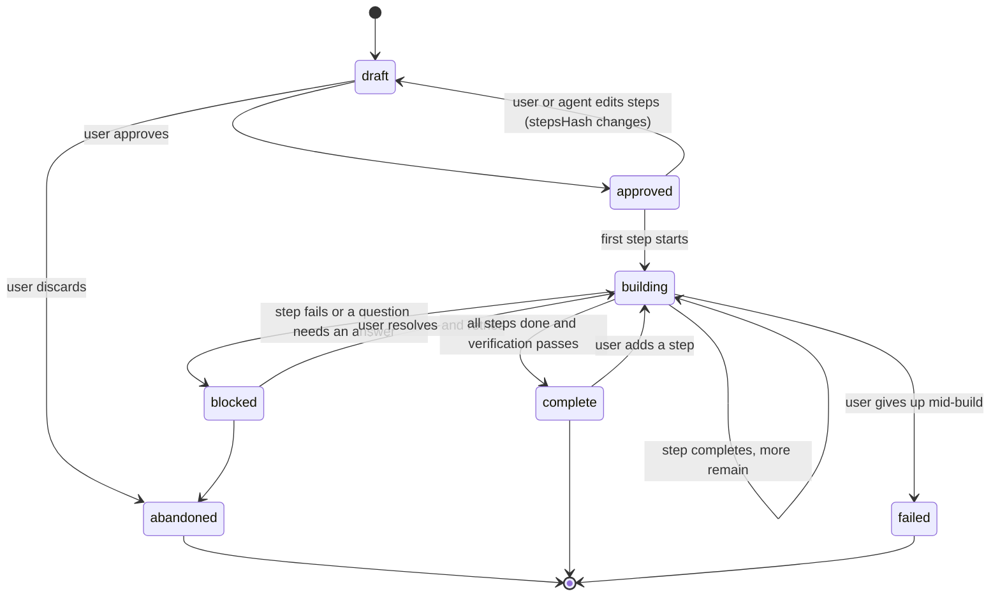

# Plan Format Specification

Spec-Version: 2.0.0

A plan is the artifact that turns a conversation into reviewable, resumable work. It is a **markdown file in the user's repository**, not a hidden database row, so it can be read, edited, diffed, reviewed in a pull request, and shared with teammates who do not use Eury Agent.

## Design decisions

| Decision | Rationale |
|---|---|
| Markdown with YAML front matter | Human-readable and diff-friendly; the file is useful even without the app |
| One machine-readable step block | Building requires structure; parsing prose is unreliable |
| Lives in the workspace, not app data | Plans belong to the project and should be reviewable in version control |
| The app owns only the status region | Everything else is safe for a human to edit at any time |
| Steps are content-hashed | Editing a step after building it is detected instead of silently diverging |

## Location and naming

```
<workspace>/.eury/plans/<YYYY-MM-DD>-<slug>-<shortid>.md
```

Example: `.eury/plans/2026-08-16-add-oauth-login-a1b2c3.md`

| Rule | Detail |
|---|---|
| Slug | Lowercase ASCII, hyphen-separated, max 48 chars, derived from the title |
| Short id | First 6 chars of the plan id, so two plans on the same topic never collide |
| Collisions | Never overwritten; a new short id is generated |
| Git | `.eury/plans/` is committable and recommended for commit. `.eury/cache/` and `.eury/runs/` are added to `.gitignore` by default |
| Discovery | The plans list is built by scanning the directory, so a hand-created file appears in the UI |
| Encoding | UTF-8, LF line endings, trailing newline required |

## Front matter

```yaml
---
specVersion: "2.0.0"
id: a1b2c3d4-...           # UUIDv7, immutable
title: Add OAuth login
status: draft              # draft|approved|building|blocked|complete|abandoned|failed
createdAt: 2026-08-16T09:00:00Z
updatedAt: 2026-08-16T09:42:00Z
createdBy: agent           # agent|user
sourceRunId: 7f3a...       # run that produced the plan
model: claude-sonnet-4     # model that authored it
mode: plan
workspace: eury-saas       # informational only; never used for path resolution
estimate:
  steps: 5
  filesTouched: 8
  confidence: medium       # low|medium|high
labels: [auth, backend]
requires:                  # preconditions the agent must not assume away
  - Postgres running locally
  - GITHUB_CLIENT_ID configured
stepsHash: sha256:4d9f...  # hash of the normalized plan_steps block
---
```

| Field | Required | Rules |
|---|---|---|
| `specVersion` | yes | Parser rejects an unknown **major** version |
| `id` | yes | Immutable; regenerating a plan creates a new file |
| `title` | yes | 3–120 chars |
| `status` | yes | Must be one of the enum values; unknown values load as `draft` with a warning |
| `createdAt` / `updatedAt` | yes | RFC3339 UTC |
| `stepsHash` | yes when steps exist | Mismatch marks the plan `edited` and requires re-approval before further building |
| Unknown fields | — | Preserved verbatim on rewrite; forward compatibility matters because humans add their own keys |

## Body sections

Required, in this order. A missing required section is a validation error the agent must fix before the plan is offered for approval.

```markdown
# Add OAuth login

## Goal
One paragraph: what will be true when this is done, in user-visible terms.

## Context
What exists today, with concrete file references.
- `src/auth/session.ts` handles local sessions
- No external identity provider is wired up

## Approach
Numbered prose describing the strategy and, briefly, the alternatives rejected.

## Files to change
| File | Change | Risk |
|------|--------|------|
| `src/auth/oauth.ts` | new: provider client | low |
| `src/auth/session.ts` | extend session shape | medium |
| `prisma/schema.prisma` | add OAuthAccount model | medium |

## Verification
How we will know it works — the exact commands and the expected results.
- `pnpm test src/auth` passes
- Manual: sign in with GitHub, session persists across restart

## Risks and open questions
- Token refresh strategy not decided
- Needs a redirect URI registered before step 4 can be verified
```

Optional sections `## Rollback`, `## Out of scope`, and `## References` are recognized and preserved. The `## Verification` section is required because a plan without a definition of success cannot be graded, and the [build mode](../01-product/03-modes-and-workflows.md) uses it as the completion check.

## Machine steps

Exactly one fenced block with the language tag `plan_steps`, containing a JSON array.

````markdown
```plan_steps
[
  {
    "id": "s1",
    "title": "Add OAuthAccount model and migration",
    "detail": "Add the model to prisma/schema.prisma, then create the migration.",
    "files": ["prisma/schema.prisma"],
    "verify": "pnpm prisma migrate dev --name oauth_account",
    "dependsOn": [],
    "risk": "medium",
    "estimateMinutes": 10
  },
  {
    "id": "s2",
    "title": "Implement the provider client",
    "detail": "Create src/auth/oauth.ts with authorize and callback handling.",
    "files": ["src/auth/oauth.ts"],
    "verify": "pnpm test src/auth/oauth.test.ts",
    "dependsOn": ["s1"],
    "risk": "low",
    "estimateMinutes": 25
  }
]
```
````

### Step schema

```typescript
interface PlanStep {
  id: string;                 // ^s[0-9]+$, unique, stable across edits
  title: string;              // 3..120 chars, imperative mood
  detail: string;             // 10..2000 chars, enough to execute without re-planning
  files?: string[];           // workspace-relative; informational, not a permission grant
  verify?: string;            // a command or a human check
  dependsOn?: string[];       // step ids; must form a DAG
  risk?: "low" | "medium" | "high";
  estimateMinutes?: number;
  requiresApproval?: boolean; // force a stop before this step regardless of grants
}
```

### Validation

| Check | Failure |
|---|---|
| Valid JSON array, 1–30 elements | `EURY_PLAN_INVALID_STEPS` |
| Unique ids matching the pattern | `EURY_PLAN_DUPLICATE_STEP` |
| `dependsOn` references exist and form a DAG | `EURY_PLAN_CYCLIC_DEPENDENCY` |
| Exactly one `plan_steps` block | `EURY_PLAN_MULTIPLE_STEP_BLOCKS` |
| `files` paths inside the workspace | `EURY_PLAN_PATH_OUTSIDE` |
| Front matter parses and required fields present | `EURY_PLAN_INVALID_FRONTMATTER` |
| Body has all required sections | `EURY_PLAN_MISSING_SECTION` |

Validation errors are shown with the exact line number and a one-click "ask the agent to fix this" action. A plan file the parser cannot read is never partially executed.

**`files` is documentation, not authorization.** Build steps still go through the normal policy and approval path; listing a path in a plan grants nothing. Any other design would make plan generation a privilege-escalation vector.

## Status lifecycle



Only the user moves a plan to `approved`. The agent may never self-approve a plan it wrote, which is the same principle as deny-by-default for tools.

## Build status region

The app owns exactly one region, delimited by markers so hand edits elsewhere are always safe:

```markdown
<!-- eury:build-status:start -->
## Build status

| Step | Status | Run | Duration | Files |
|------|--------|-----|----------|-------|
| s1 Add OAuthAccount model | done | [run 7f3a](eury://run/7f3a) | 2m 14s | 2 changed |
| s2 Implement provider client | in progress | [run 8b1c](eury://run/8b1c) | — | — |
| s3 Wire routes | pending | — | — | — |

Last updated: 2026-08-16T09:42:00Z
<!-- eury:build-status:end -->
```

| Rule | Detail |
|---|---|
| Region ownership | Content between the markers is regenerated wholesale; everything outside is never touched |
| Missing markers | Appended at the end of the file on first build |
| Writes | Atomic temp-file-and-rename, same as any other file write |
| External edits | If the file changed on disk since it was read, the app re-reads and re-applies rather than overwriting |
| Step status | `pending`, `in progress`, `done`, `failed`, `skipped`, `blocked` |
| Run links | `eury://run/<id>` deep links resolve inside the app and degrade to plain text elsewhere |

## Build execution

| Rule | Detail |
|---|---|
| Order | Topological by `dependsOn`; independent steps still run one at a time by default |
| Isolation | One run per step, with its own checkpoint, so a single step can be reverted |
| Approval | Normal deny-by-default flow. `requiresApproval: true` forces a stop even when grants would allow it |
| Context | The step's `detail`, the plan's Goal and Context sections, prior step outcomes, and retrieval for the listed files |
| Verification | If `verify` is a command, it runs after the step; a non-zero exit marks the step `failed` and moves the plan to `blocked` |
| Failure | Building halts. The user may retry, skip, edit the plan, or revert the step's checkpoint |
| Drift | If files changed outside the build since the plan was approved, the user is warned before the next step |
| Cost | Per-step and cumulative cost is tracked against the plan, subject to the run and budget caps |
| Resume | Build is fully resumable after a crash or quit; step status lives in the file and in the store |

## Editing and regeneration

Editing steps recomputes `stepsHash`. If steps were already built, the plan returns to `draft` and requires re-approval; completed step statuses are preserved so nothing is redone unnecessarily. Regeneration always produces a **new file**, with `supersedes` in the front matter pointing at the old one, which is marked `abandoned`. Plans are never rewritten in place by regeneration, because the previous plan is often the better record of intent.

## UI surface

The plan card shows title, status, step list with progress, cost so far, and estimate. Actions: Approve, Build next step, Build all, Open file, Edit in the editor, Revert step, Abandon, Regenerate. The Plans surface lists all plans in the workspace with status filters ([app shell](../05-ui/02-app-shell-and-navigation.md)).

## Conformance tests

| ID | Test |
|---|---|
| T1 | Round-trip: parse then serialize preserves unknown front-matter fields and all prose byte-for-byte outside the status region |
| T2 | Every validation error fires on a crafted fixture with the correct line number |
| T3 | Cyclic `dependsOn` is rejected |
| T4 | Hand edits outside the markers survive a build-status update |
| T5 | A `files` entry pointing outside the workspace is rejected, and listing a path grants no permission (verified by a denial test) |
| T6 | Editing a built step returns the plan to `draft` and preserves completed statuses |
| T7 | A crash mid-build resumes at the correct step |
| T8 | A failed `verify` command blocks the plan and offers revert |
| T9 | The agent cannot transition a plan to `approved` |
| T10 | An unknown major `specVersion` is refused, not partially parsed |
| T11 | Two plans generated from the same title in the same minute produce distinct files |
| T12 | Deep links in the status table resolve to the correct runs |

## Related documents

- [Modes and workflows](../01-product/03-modes-and-workflows.md)
- [Agent runtime](01-agent-runtime-spec.md)
- [Checkpoints and rollback](12-checkpoint-and-rollback-spec.md)
- [Error taxonomy](15-error-taxonomy.md)
