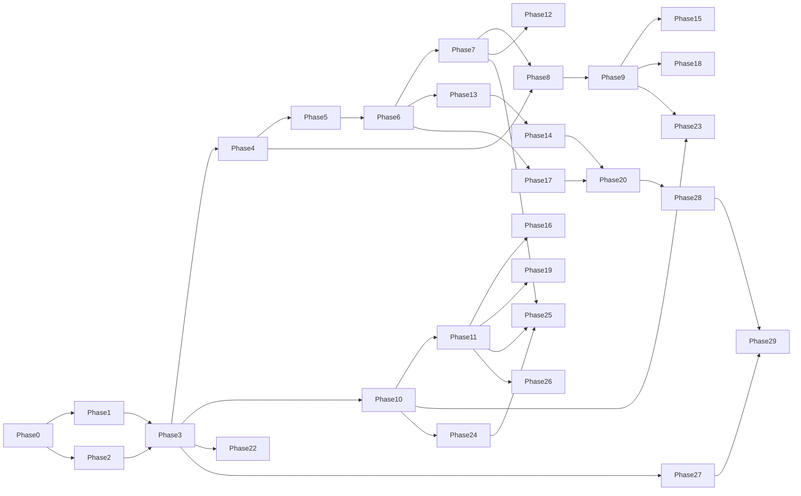

# Roadmap Overview

Spec-Version: 1.1.0

30 phases (0–29) delivering Eury Agent from documentation through GA. Each phase file states its goal, why it sits where it does, deliverables with spec references, contracts, risks, test plan, measurable targets, and exit criteria.

**Phase FF (Fast Forward MVP)** is an optional acceleration track that ships a minimal end-to-end desktop experience (Home cloud chat + Code folder agent) while the formal phases continue. See [phase-ff.md](phase-ff.md).

## Tracks

| Track | Phases | Theme |
|-------|--------|-------|
| **A** Foundations | 0–2 | Governance, product definition, security design |
| **B** Core runtime | 3–9 | Shell, agent core, sandbox, tools, policy, chat, persistence |
| **C** Product surfaces | 10–14 | Identity, models and cost, terminal, editor, git |
| **D** Intelligence | 15–20 | Index, memory, plans, checkpoints, MCP, multi-agent |
| **E** Depth | 21–23 | Background work, preview, sync |
| **F** Enterprise and GA | 24–29 | SSO, governance, observability, release, quality, launch |

## Ordering principles

- Security design (Phase 2) precedes the sandbox (Phase 5), which precedes tools (Phase 6), which precedes approvals (Phase 7). Containment is never retrofitted.
- Identity (Phase 10) precedes anything commercial or enterprise, and is built as a self-contained module from the first commit ([module structure](../04-specs/16-backend-module-structure.md)).
- Intelligence (indexing, memory, plans) comes after the core loop works, because tuning retrieval against a moving runtime is wasted effort.
- Enterprise governance (Phases 24–25) comes after the product is stable, because governing a moving target is wasted effort.
- Quality infrastructure (Phase 28) gates GA and depends on everything before it.

## Dependency graph



## Milestones

| Milestone | Phase | User-visible |
|-----------|-------|--------------|
| **M0 Docs** | 0–2 | Documentation complete (this deliverable) |
| **M1 Alpha** | 9 | Chat + agent + tools + persistence (internal) |
| **M2 Beta** | 17 | Plans, memory, editor, git |
| **M3 RC** | 23 | Sync, preview, MCP |
| **M4 GA** | 29 | Enterprise + signed release |

## Phase index

| Phase | Title | File |
|-------|-------|------|
| 0 | Governance and Repo Foundation | [phase-00.md](phase-00.md) |
| 1 | Product Definition | [phase-01.md](phase-01.md) |
| 2 | Security Foundation | [phase-02.md](phase-02.md) |
| 3 | Desktop Shell | [phase-03.md](phase-03.md) |
| 4 | Agent Core | [phase-04.md](phase-04.md) |
| 5 | Workspace and Sandbox | [phase-05.md](phase-05.md) |
| 6 | Tool Layer v1 | [phase-06.md](phase-06.md) |
| 7 | Policy and Approval | [phase-07.md](phase-07.md) |
| 8 | Chat Experience | [phase-08.md](phase-08.md) |
| 9 | Local Persistence | [phase-09.md](phase-09.md) |
| 10 | Identity | [phase-10.md](phase-10.md) |
| 11 | Model Routing and Cost | [phase-11.md](phase-11.md) |
| 12 | Terminal | [phase-12.md](phase-12.md) |
| 13 | Editor and Explorer | [phase-13.md](phase-13.md) |
| 14 | Git | [phase-14.md](phase-14.md) |
| 15 | Code Intelligence | [phase-15.md](phase-15.md) |
| 16 | Memory | [phase-16.md](phase-16.md) |
| 17 | Modes and Plan Execution | [phase-17.md](phase-17.md) |
| 18 | Checkpoints and Rollback | [phase-18.md](phase-18.md) |
| 19 | MCP | [phase-19.md](phase-19.md) |
| 20 | Multi-Agent Orchestration | [phase-20.md](phase-20.md) |
| 21 | Background and Scheduled Work | [phase-21.md](phase-21.md) |
| 22 | Preview Runtime | [phase-22.md](phase-22.md) |
| 23 | Cloud Sync and Collaboration | [phase-23.md](phase-23.md) |
| 24 | Enterprise Identity and Governance | [phase-24.md](phase-24.md) |
| 25 | Policy, Audit, Quotas | [phase-25.md](phase-25.md) |
| 26 | Observability and Reliability | [phase-26.md](phase-26.md) |
| 27 | Packaging and Release Engineering | [phase-27.md](phase-27.md) |
| 28 | Quality and Evaluation | [phase-28.md](phase-28.md) |
| 29 | GA Launch | [phase-29.md](phase-29.md) |
| FF | Fast Forward MVP (optional) | [phase-ff.md](phase-ff.md) |

## Regenerating phase files

```bash
python3 agent/docs/09-roadmap/generate_phases.py
```

Edit `generate_phases.py` then regenerate; or edit phase files directly for one-off changes.

## Related

- [risk-register.md](risk-register.md)
- [open-questions.md](open-questions.md)
- [Documentation index](../00-index.md)
- [Definition of done](../08-quality/05-definition-of-done.md)
- [Naming and migration map](../00-overview/05-naming-and-migration-map.md)
